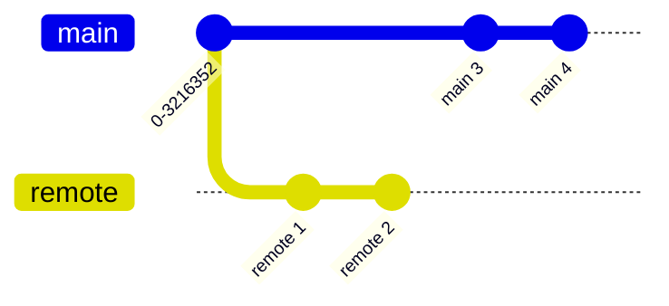
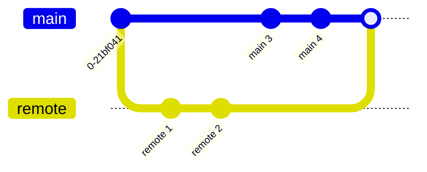
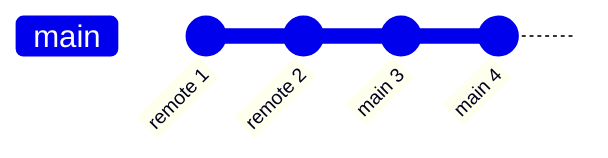

---
A case

My local branch diverged with the remote branch.

I run `git push` it failed:

> [!fail] push failed
> because the remote contains work that you do not have locally. run `git pull` before push.

git pull noticed that I would need to merge or rebase to solve the divergent problem.

the merge senario:

I went with the rebase route `git rebase main/origin`

There was conflict, and I manually resolved it.

2024-04-11